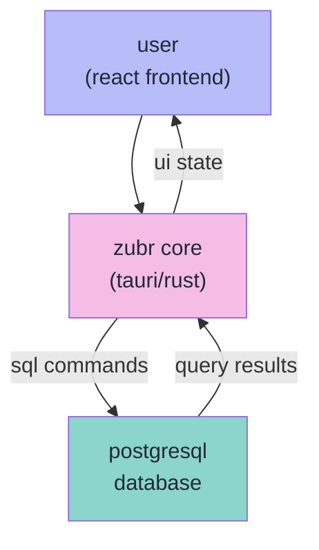

# 🦬 **zubr**

_a modern, powerful desktop gui for postgresql_

---

**the for now not so ultimate desktop client for postgresql, supercharged with vector visualization for ai/ml.**

_perfect for developers, data scientists, and anyone working with `pg_vector` and modern data applications._

> **a note on technology:** i'm not a huge rust fanboy, but i am a fan of my ram. zubr is built with tauri instead of electron to keep it lightweight and fast.

## ✨ features

- ✅ **modern & fast ui**: a clean and responsive user interface built with react and tailwindcss.
- ✅ **direct postgresql connection**: connect securely and directly to your local or remote postgresql databases.
- ✅ **schema & table navigation**: easily browse schemas and tables in a dedicated sidebar.
- ✅ **vector embedding visualization**: a fancy feature to inspect `pg_vector` embeddings with a heatmap, stats, and raw values.
- ✅ **cross-platform**: built with tauri to run natively on macos, windows, and linux.

## 🏗️ architecture

### how it works

- **frontend**: a modern react application provides the user interface for all database interactions.
- **core**: the tauri backend, written in rust, handles the native window, os integrations, and manages the direct connection to the postgresql database.
- **postgresql**: zubr communicates with any standard postgresql database, with special features for the `pg_vector` extension.

## 🗺️ roadmap

### ✅ **what works now**

- ✅ **database connection**: establish a connection to a single postgresql database.
- ✅ **schema/table browsing**: view a list of schemas and the tables within them.
- ✅ **data viewing**: display table data in a clean, readable grid.
- ✅ **vector visualization**: inspect vector embeddings from your table.

### 🔄 **working on next**

- 🔄 **connection manager**: save and manage multiple database connections.
- 🔄 **in-cell data editing**: edit data directly within the table grid.
- 🔄 **advanced filtering**: a dedicated ui to build complex `where` clauses without writing sql.

### 📋 **planned improvements**

- 📋 **sql query editor**: a full-featured sql editor with syntax highlighting and autocompletion.
- 📋 **tabbed interface**: open multiple tables and queries in separate tabs.
- 📋 **vector similarity search**: a ui to perform `k-nn` similarity searches on your vector columns.
- and many more ...

### **legend**

- ✅ **completed** - ready to use
- 🔄 **in progress** - actively being developed
- 📋 **planned** - scheduled for development

### 🤝 contributing

this project is not yet ready for contributions, but please check back soon! when it is, we'll be looking for help with:

1.  bug fixes and reporting.
2.  implementing new features from the roadmap.
3.  improving documentation.

but if you want, you can already start testing it and making issues

## 📄 license

this project is licensed under the mit license.
